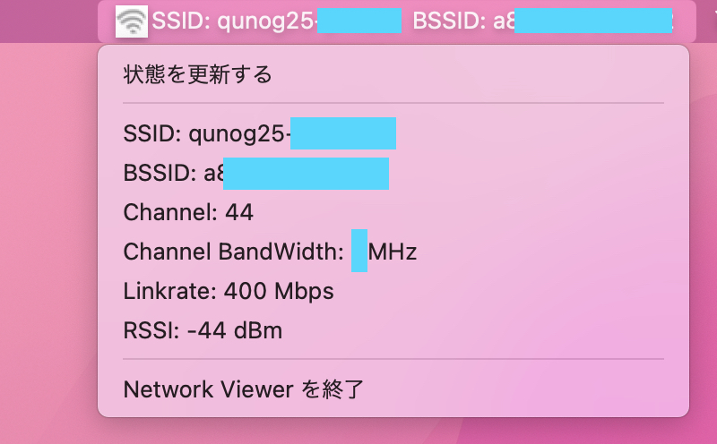

# network-viewer

Network Viewer はmacOSのメニューバーに端末のネットワーク等の情報を表示し、Wi-Fi等のネットワークに関するトラブルシューティングを行う際に作業をサポートするツールです。

Electron アプリとして制作しました。



## Requirement

### 確認済みの環境:

- OS: macOS
- Node.js version: v18.12.0
- npm version: 8.19.x

## Install && Usage

```
$ git clone https://github.com/yu1k/network-viewer.git network-viewer && cd $_
$ npm install && npm run build
```

GitHubからcloneしてElectronアプリをビルドします。

ビルドが終わったあとは、network-viewerディレクトリ直下の ./dist/ ディレクトリの下に生成された .dmg ファイルを展開します。

### BSSID を取得したい場合

端末のWi-Fi情報を取得するためにこのアプリではmacOS標準搭載のairportというツールを利用しています。

airportでBSSIDを取得したい場合はスーパーユーザの権限が必要になるので、Electronアプリを実行するユーザのパスワード(macOSにログインする際に使用しているパスワード)を NETWORK_VIEWER_PASSWORD という環境変数に格納します。

```
$ export NETWORK_VIEWER_PASSWORD='ユーザのパスワード'
```

Network Viewerをアンインストールした際、またはBSSIDの取得が必要なくなった際は、下記コマンドを実行し、設定時に設定した環境変数を削除してください。

```
$ unset NETWORK_VIEWER_PASSWORD
```

BSSIDの取得が必要でないならば上記の手順は必要ありません。

## Run test

```
$ npm run test
```

自動テストを実行します。

## エラー集

```
$ brew update && brew install pyenv
$ vim ~/.bashrc
```

```
export PYENV_ROOT="$HOME/.pyenv"
export PATH="$PYENV_ROOT/bin:$PATH"
eval "$(pyenv init --path)"
eval "$(pyenv init -)"
```

```
$ source ~/.bash_profile

$ pyenv install --list | grep '2.'
$ pyenv install 2.7.18
```

```
$ pyenv versions
$ pyenv local 2.7.18
```

使用するPythonのバージョンを指定する

```
[user@MacBook:~/workspace/network-viewer ] $  pyenv versions
* system (set by /Users/yu1k/.pyenv/version)
  2.7.18
[user@MacBook:~/workspace/network-viewer ] $ pyenv local 2.7.18
```

```
$ export PYTHON_PATH=/Users/$(whoami)/.pyenv/shims/python2 npm run build
```

Electron でビルドしようとするとエラーが出力されました。

`$ python2 -v` したら入っていませんでした。Electronでビルドする際にPython2が必要のようなので、上記のコマンドを実行してPython2をインストールします。

エラーメッセージにあるように、python2がインストールされたマシンなら `$ which python2` を実行して表示されたPATHを `export PYTHON_PATH=` に入れて実行する方法でも回避できるようです。

Python2のインストールが難しければ、electron-builder 23.0.x系をインストールしてElectronアプリをビルドします。

### process.env を読み込めない

dotenvモジュールをrequireします。

## TODO

- [ ] グローバルIPアドレスの取得
- [ ] テストコードを書く
- [ ] CIを構築する

## Thanks

グローバルIPアドレスの取得に [ipinfo.io](https://ipinfo.io/) を使用しています。

## License

[./assets/](./assets/) ディレクトリの下に格納されている画像は [yu1k](https://github.com/yu1k/) がメモ帳に手書きで描いて作成した画像です。